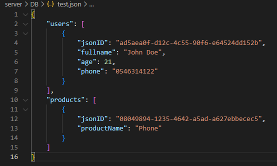
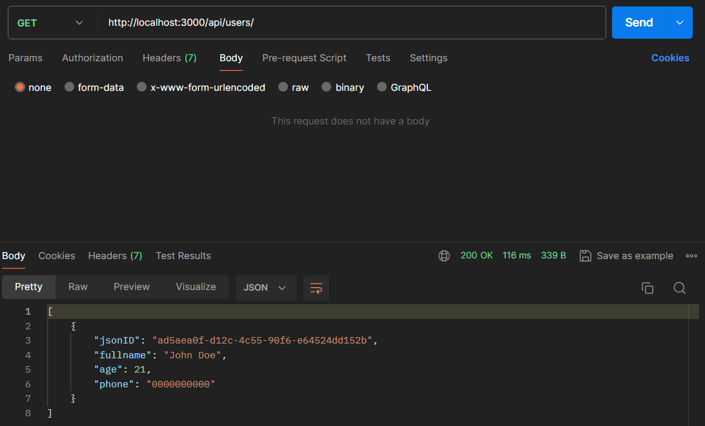
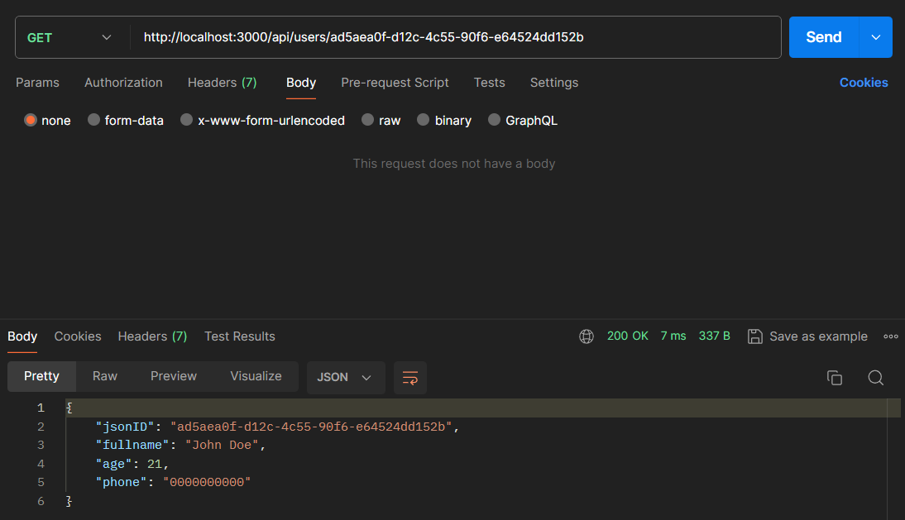
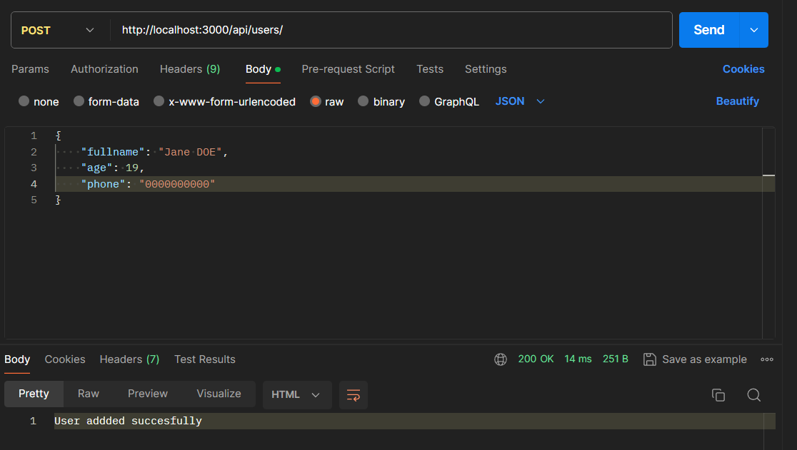
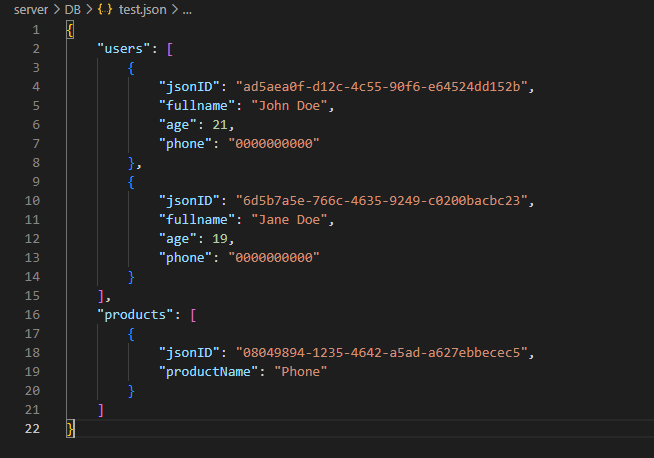
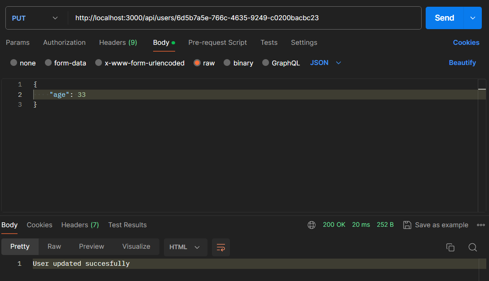
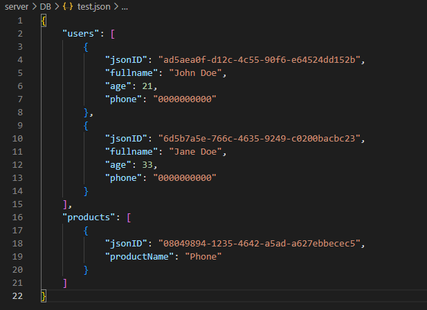
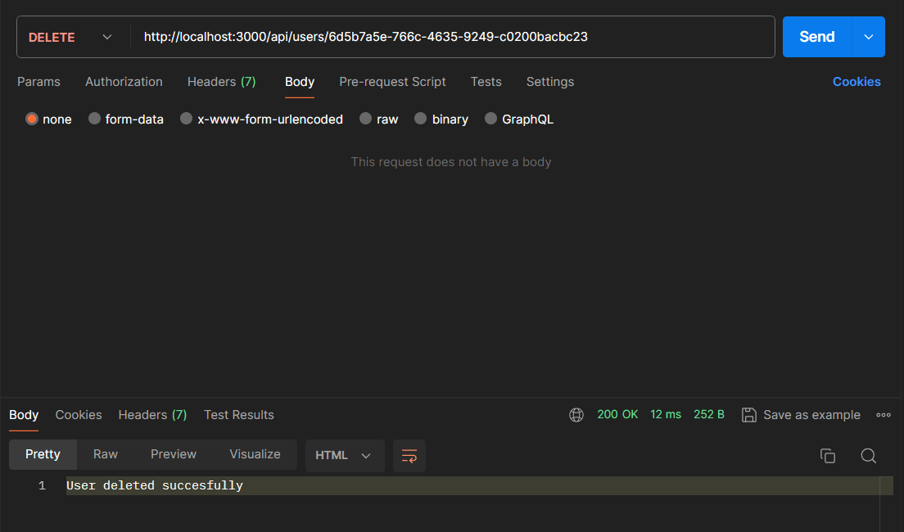
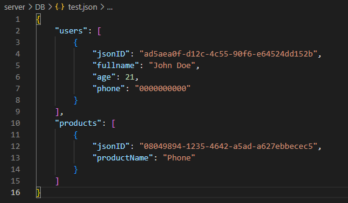

# What is jsonDBKit?
The **jsonDBKit** library provides an easy way to work with JSON data as a database.

## Why jsonDBKit?
- Easy to use.
- An easy way to implement a simple database into your project.
- The JSON file serves as the database.
- Contains full **CRUD** methoods.
- Works perfectly in combination with:
  - Express.js
  - HTTP module
- All changes are immediately visible.
- Open source.

## Methoods:

- ```js
   jsonDB.connectDB(path: string): Promise<void>
  ```
  - Method for connecting to the database. Accepts the path to the JSON file. Upon successful connection, it validates the file structure and creates a unique identifier (`jsonID`) generated with **uuid** for the first object in the collections if it doesn't exist yet.

- ```js
   jsonDB.jsonGetAllCollections(): Promise<object>
  ```
  - Method to retrieve all collections from the database. Returns an object where the keys are the collection names, and the values are arrays of objects from each collection.

- ```js
   jsonDB.jsonGetCollection(collectionName: string): Promise<object[]>
  ```
   - Method to retrieve a specific collection by its name. Accepts the collection name as an argument and returns an array of objects from that collection.
  
- ```js
   jsonDB.jsonGetOne(collectionName: string, id: string): Promise<object | undefined>
  ```
   - Method to retrieve a single object from a collection by its unique identifier. Accepts the collection name and object identifier as arguments. Returns the object or undefined if the object is not found.
  
- ```js
   jsonDB.jsonAdd(collectionName: string, content: object): Promise<object>
  ```
   - Method to add a new object to a collection. Accepts the collection name and the object to add. Returns the added object with a unique identifier assigned.
  
- ```js
   jsonDB.jsonFoundOneAndUpdate(collectionName: string, id: string, obj: object): Promise<object | undefined>
  ```
   - Method to update an object in a collection by its identifier. Accepts the collection name, object identifier, and object with updated data. Returns the updated object or undefined if the object is not found.
  
- ```js
   jsonDB.jsonDelete(collectionName: string, id: string): Promise<number | undefined> Promise<object | undefined>
  ```
   - Method to delete an object from a collection by its identifier. Accepts the collection name and object identifier. Returns the index of the deleted object or undefined if the object is not found.
  
## First steps (My example)

To install the `jsondbkit` library, run the following command:


```bash
npm install --save jsondbkit
```
1.  Create folder for your database:
   
    

2. Create `JSON` file inside your folder:
    
    

3. ***Important!:*** 
   
    To work successfully with the database, you need to create a **schema** of your database inside your `JSON` file.

    Example of your schema:
    ```json
    {
        "users": [
            {
                "fullname": "John Doe",
                "age":  30,
                "phone": "xxxxxxxxxx"
            }
        ],
        "products": [
            {
                "productName": "Phone"
            }
        ]
    }
    ```

    ***Important Notes!:***
    
    - The object must contain a field - collection (in this example, collections are represented by "products" and "users"). There can be as many collections as desired (the only drawback is that they need to be entered manually at the moment).
  
    - The collection must be an array.
  
    - The array must contain objects. 
    
      **Note:** For proper operation, each collection must contain exactly one object before working with the database

    - The object should not contain the jsonID property. After running, unique identifiers will be added to each object in each collection in the database.
    
    
    - After following all instructions and running the application, your JSON file will be automatically overwritten. If you use Nodemon, all subsequent changes (additions, deletions, edits) will occur automatically, overwriting your file with new data, while preserving the entire order.
    
  
4. Create `Express` Server:
    ```javascript
    const express = require('express');
    const app = express();
    const usersRouter = require('./routes/usersRouter');
    const connectToJsonDB = require('./configs/connectToJsonDB');
    const PORT = 3000;

    //configs
    connectToJsonDB();

    //MIDDLEWARES
    app.use(express.json());

    //ROUTES
    app.use('/api/users', usersRouter);

    //LISTEN
    app.listen(PORT, () => {
        console.log(`Server is running: http://localhost:${PORT}`);
    });
    ```

5. Create your connect methood:

   I moved the function to a separate file:
    ```js
    const jsonDB = require('jsondbkit');


    const connectToJsonDB = () => {
        jsonDB.connectDB('./DB/test.json')
         .then(() => console.log('DB is OK'))
            .catch((err) => console.log(err));
    }

    module.exports = connectToJsonDB;
    ```

6. Create `routes` folder:
   
   

   
   In this example i will show only on "users" collection(for other collections, everything is absolutely identical)

   **All routes for users:**
   ```js
    const express = require('express');
    const router = express.Router();
    const usersDLL = require('../DLL/usersDLL');

    router.get('/', async(req, res) => {
        const response = await usersDLL.getAllUsers();

        res.send(response);
    });

    router.get('/:id', async(req, res) => {
        const id = req.params.id;
        const response = await usersDLL.getOneUser(id);

        res.send(response);
    });

    router.post('/', async(req, res) => {
        const obj = req.body;
        const response = await usersDLL.addNewUser(obj);
        
        res.send(response);
    });

    router.put('/:id', async(req, res) => {
        const id = req.params.id;
        const obj = req.body;
        const response = await usersDLL.updateUser(id, obj);

        res.send(response);
    });

    router.delete('/:id', async(req, res) => {
        const id = req.params.id;
        const response = await usersDLL.deleteUser(id);

        res.send(response);
    });

    module.exports = router;
   ```

7. Let's move all CRUD methods to a separate folder 
   
   

   ```js
    const jsonDB = require('jsondbkit');

    const getAllUsers = async () => {
        return jsonDB.jsonGetCollection("users");
    }

    const getOneUser = async (id) => {
        return await jsonDB.jsonGetOne("users", id);
    }

    const addNewUser = async (obj) => {
        await jsonDB.jsonAdd("users", obj);
        return 'User addded succesfully';
    }

    const updateUser = async (id, obj) => {
        await jsonDB.jsonFoundOneAndUpdate("users", id, obj);
        return 'User updated succesfully';
    }

    const deleteUser = async (id) => {
        let response = await jsonDB.jsonDelete("users", id);
        if (!response) {
            return 'Not found';
        }
        return 'User deleted succesfully';
    }

    module.exports = {
        getAllUsers,
        getOneUser,
        addNewUser,
        updateUser,
        deleteUser
    }
   ```

8. Let's check with Postman:
   
   - **getAllUsers**
   

   - **getOneUser**
    

   - **addNewUser**
   

        **Result in json:**   
        

    - **updateUser**
   

        **Result in json:**   
        
    
    - **deleteUser**
   

        **Result in json:**   
        
   
   